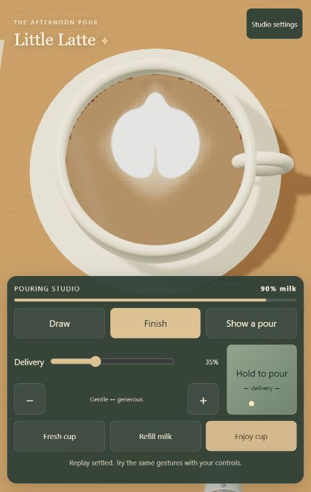

# Little Latte: pouring and graphics audit

**Historical first audit.** The [second audit: direction, fidelity and photo collection](fidelity-direction-photo-audit-2026-10-07.md) records the newer build and current priorities. Retain this document for the environment brief and earlier baseline; its current-state findings are not all still applicable.

7 October 2026 · current working tree · audit and proposed build, not an implementation

## Recommendation

Keep the existing Three.js game and its recording/accounting foundation. Make one dependable default pouring experience, then give the cup, liquid and pitcher a substantial visual upgrade. Do not start another wholesale solver rewrite or expand puzzle content yet.

The game has progressed beyond the older white-blob checkpoint. The current default is `hydrostatic-film-4`: 48² bulk liquid with a 160² optical milk field. The alternative GPU mode is `gpu-volume-film-2`, using the same fine optical model. It can produce separated bands and a two-lobed heart-like form. It is still an empirical pouring sandbox, with gaps between isolated demonstrations, default equipment assistance, believable liquid motion and everyday player control.

Recommended art direction: **a lush, intimate coffee corner, with warm café realism and restrained stylization**. Rich espresso, satin microfoam, glazed ceramic, reflective brushed steel, warm window light and quiet sage/cream controls. Build a space the player wants to spend time in: plants, a window nook, shelves and personal details are a core part of the upgrade. The environment deserves its own substantial art milestone alongside pouring improvements.

Updated direction following user feedback: world building, graphics and lighting have equal product importance to the pouring improvements. The earlier proposal understated the environment work.

Control preference: **Advanced controls are the default**, with independent flow and height visible, wheel adjustment for height, A/D for flow and Shift for fine control. Cozy remains an optional setting. Keep this default in the redesigned interface; a cozy atmosphere does not require simplified pouring controls. Imported recordings retain their recorded control scheme.

## Evidence and scope

Fresh checks on this working tree:

- All **50 automated tests pass**, zero skipped or failed; approximately 86 seconds.
- TypeScript `--noEmit` passes.
- Vite production build passes. Main JavaScript is 577.45 kB minified / 154.76 kB gzip, with the existing large-chunk warning.
- Launched the current app and ran **Show a pour** in the default mode with rim assistance checked, in the in-app browser. Captured the completed result below.
- Inspected current pouring, equipment, rendering, input, replay and test code; evaluated equipment-clearance calculations at multiple positions using the actual module.
- Earlier browser recordings and GPU reports were reviewed as historical evidence, not represented as newly rerun GPU tests.



This portrait capture shows the actual game, not a proposed redesign. The result retains lobes and a cleft, but the tip is rounded, the white region is nearly uniform, and the coffee reads as a flat tan surface. The control panel occupies roughly the lower two-fifths of this view. These are visual judgments, not physical measurements.

Limits: no new physical-phone or human usability study; no fresh GPU feasibility matrix or full-frame performance benchmark. Browser demo playback is not proof of human reproducibility. The repository already contains extensive uncommitted work; this audit adds documentation and a screenshot without changing gameplay source.

## Findings, in priority order

### P1 — Draw changes character depending on position and equipment access

`src/cozy-controls.ts:5` requests 2.8 mm clearance for Draw. `src/equipment.ts:8–24` applies an upright pitcher bound and adds cup headroom when that bound intersects the rim. Its rim-conflict decision is binary. In the same fresh 63 ml cup at 35% delivery:

| Aim in normalized cup coordinates | Requested clearance | Calculated clearance | Film low-pour weight |
| --- | ---: | ---: | ---: |
| Center (0.50, 0.50) | 2.8 mm | 3.00 mm | 0.988 |
| Forward/upper region (0.50, 0.25) | 2.8 mm | 14.46 mm | 0.130 |
| Lower region (0.50, 0.90) | 2.8 mm | 3.00 mm | 0.988 |

These are direct calculations with uniform initial depth, not measurements during a moving pour. The low-pour weight is the game's `1 / (1 + (clearance / 9 mm)^4)`, not a measured milk property. At 65% delivery, the forward-region calculation still gives 13.81 mm and a weight of 0.153.

**Player consequence:** an unchanged Draw setting can go from spreading white milk to a much more penetrating response as the pitcher approaches an access boundary. A clearance message explains the raise but does not make the interaction predictable. This is a high-confidence contributor to inconsistent pouring, not proof that it explains every unsatisfying gesture.

**Build response:** share an explicit vessel/pose model between geometry and clearance; replace the abrupt bound with continuous reachable-pose handling. Establish a useful drawing area first. Add real assisted cup tilt only with correct surface, targeting and rim geometry; never visually tilt a flat local liquid disk as a shortcut.

### P1 — The visible pattern and bulk liquid do not share surface transport

`src/cozy-view.ts:15` advances the bulk and then calls `film.step(sources, dt)`. The film receives sources, not the bulk's velocity, foam or outflow fields. In `src/latte-film.ts:19`, its own flow decays with a 35 ms time constant; it eventually returns early when quiet. The GPU mode also feeds accepted sources to this same film.

The fine field is a useful optical attribute, not a second conserved milk inventory. However, its visual motion is largely independent of continued bulk movement and constituent withdrawal. Current overflow removes a well-mixed fraction of bulk fields, without corresponding film export. This helps art survive but can make it feel detached from the liquid carrying it.

**Build response:** prototype bounded coupling to surface velocity, local mixing and outflow, preserving fine boundaries. Compare against the present model before replacing it. Simply advecting with all coarse bulk velocity may smear the art and repeat an earlier failure. Do not promote the GPU mode merely because it is called 3D: both use the same art response.

### P1 — Passing heart tests cover a narrower problem than satisfying player pouring

`tests/heart-probe.ts:14` disables equipment assistance and uses a simplified evolving fill. `tests/heart.test.ts` checks notch, lobe retention and tip width across three cut speeds. These are valuable regressions but do not cover default assisted reach, the actual input/control transitions, broad placement or intuitive manual reproduction.

The current browser demo is recognizably closer to a heart than older results, yet its tip remains blunt and its broad white lobes lack convincing internal texture. Existing test success should be retained as a floor, not used as the product acceptance gate.

**Build response:** add an end-to-end default-path matrix and human attempts. Test pool growth, neighboring displacement and bands separately before tuning a complete heart. Include deliberately imperfect cuts; never recognize a target shape or stamp one into the field.

### P1 — The liquid shader is the biggest graphics bottleneck

`src/scene.ts:31` blends hand-selected coffee/cream colors and adds a small analytic highlight. It calculates some height-based shading for the free surface, but does not use the scene's actual lighting and environment reflections as a coherent liquid material. The stream uses an unlit `MeshBasicMaterial` at line 42. A richer room will not fix this central visual mismatch.

**Build response:** give coffee and milk a shared, light-responsive surface with meaningful normals, controlled roughness, subtle Fresnel reflection, a rim meniscus and a small impact disturbance. Keep white milk readable under highlights. Introduce restrained crema variation that follows the transported surface; avoid static decorative noise that looks painted onto the screen. The stream needs matching lighting and computed normals if its material becomes lit.

### P2 — Cup, pitcher and lighting still expose primitive construction

The cup/rim/handle and pitcher are assembled from cylinders, toruses and a cone; the pitcher is missing convincing spout and wall detail. The scene has hemisphere/directional light but no environment map. The very top-down orthographic composition and flat materials limit depth cues. The visible inner-rim edge also shows dark irregularities in the capture; inspect geometry/shadow bias before naming one cause.

**Build response:** make the cup and pitcher hero assets with believable wall thickness, bevels, clean silhouettes and a shaped pouring lip. Their units and collision envelope must agree. Add a controlled studio/café reflection environment, softer contact shadows, glazed ceramic and brushed steel. Keep a stable near-top-down play camera; use a more oblique camera for Enjoy cup. Do not move the camera while the player draws.

### P2 — UI occupies attention needed for the cup

Draw/Finish is a good simplification. However, the persistent pour pad, delivery controls, three action buttons and status line dominate the portrait view. The pad is useful for touch, while mouse users already pour directly on the cup. Instruction text such as “forward” lacks a clear visual direction cue. Initial load starts at 65% delivery; Fresh cup starts at 35% (`src/main.ts:69,175,289`), making the initial learning experience inconsistent.

**Build response:** use one start/reset configuration; show an optional short directional lesson; keep Draw/Finish, delivery and milk readable in a smaller dock. Offer the large pad for touch and retain accessible alternatives for other input. Put refill and less frequent actions in secondary UI. Do not shrink touch targets to make the panel fit.

### P2 — Performance and maintainability need a bounded pass

Film source forces iterate across all active film cells for every source packet; advection can substep. Texture data is repacked/uploaded each render even when the visible field is unchanged. Many concerns are compressed into `main.ts` and `scene.ts`, while historical reports describe different defaults. Quality currently mainly changes pixel ratio.

**Build response:** profile before increasing resolution or adding effects. Cache unchanged uploads, keep visual quality separate from physical behavior, and split optional diagnostic/legacy code when measured startup benefit justifies it. Extract named configurations for controls, film response and equipment geometry as those systems change. Preserve versioned replay compatibility. Publish one authoritative current-state note with old checkpoints clearly marked.

## Build sequence

### Milestone 0 — Trustworthy baseline and shared configuration

**Work:** preserve this working state through the normal repository workflow; capture center/off-center pools, heart, rosetta, two pours, dry movement, raised mixing and rest. Create one initialization path for launch/reset/demo. Put requested and actual clearance, accepted flow, fill and assist state in developer captures. Store solver version and relevant configuration in recordings.

**Files:** `main.ts`, `cozy-controls.ts`, `recording.ts`, tests and evidence reports.

**Done when:** launch and Fresh cup produce identical physical settings; baseline recordings reproduce; existing 50 checks remain green; new assisted-path evidence is reproducible. Keep numerical field captures and rendered screenshots paired.

### Milestone 1 — Dependable pouring and reachable equipment

**Work:** resolve access discontinuities and align the visible pitcher with its collision/spout model. Probe actual clearance across the drawing region and fill levels. Retune Draw/Finish only after that is stable. Add explicit directional teaching for placing a pool and drawing the cut. Implement cup tilt as a separate bounded substep if pose improvements alone cannot provide useful close access.

**Files:** `equipment.ts`, `jet.ts`, `cozy-controls.ts`, `main.ts`, shared vessel configuration; `scene.ts` and liquid geometry if tilt is introduced.

**Provisional product gates:** at three deliveries (25/50/75%), three initial fills (63/80/95 ml) and center plus four offset positions, classify every case as reachable Draw or visibly constrained. Within the declared drawing area, target actual Draw clearance 2–6 mm without an abrupt jump across adjacent positions. Never obtain this by clipping equipment. Verify stream endpoint/aim agreement within 1 CSS pixel in tested layouts. Keep release, cancellation and dry reposition dry.

### Milestone 2 — Surface response that feels like carried milk

**Work:** test limited bulk-to-film velocity coupling and local exchange/outflow; keep the current optical model as an A/B baseline. Tune pool spread, displacement, folding and finishing as separate primitives. Parameterize the existing empirical constants by meaning and units. Improve the cut without preserving lobes through a hidden art mask. Audit wall transport and overflow removal in the fine field.

**Files:** `latte-film.ts`, `cozy-liquid.ts`, `cozy-view.ts`, `liquid3d.ts` adapter, `art-metrics.ts`, focused integration tests.

**Done when:** repeated stationary pours visibly grow; a second pour carries identifiable first-pour material; moderate wiggles retain alternating bands; raising changes mixing; a central cut forms a taper while preserving surrounding lobes; art remains readable after ten seconds of legitimate settling. Existing inventory and near-zero-flow guarantees remain intact. Compare one finer surface grid to distinguish numerical diffusion from tuning. Do not claim scientific calibration from these product gates.

**Usability gate:** five new players, each given the same short lesson and up to five attempts; provisional target four of five make a recognizable heart and can deliberately explain/control a low pool versus a raised cut. Collect failures and revise the target if justified. This is planned validation, not a completed study.

### Milestone 3 — One polished cup, stream and pitcher

**Work:** build a visual comparison scene with fixed recorded pours and camera. Upgrade liquid shading first, then cup/pitcher assets and reflection lighting. Add a plausible meniscus and restrained surface microdetail. Fix rim/shadow artifacts. Keep the art model independent of presentation settings.

**Asset list:** one ceramic cup/saucer set; one stainless pitcher with interior, handle and pouring lip; one wood material; one authored or licensed reflection environment; a small crema/roughness detail set if procedural detail is insufficient. Record licensing and scale. No asset shopping or generation is required for this audit.

**Files:** split `scene.ts` into liquid material, equipment, lighting and camera modules; add organized assets under `public/`.

**Done when:** side-by-side captures at identical simulation states show obvious improvements in wetness, ceramic glaze, steel reflection, rim contact and stream continuity. No reflection obscures the finishing tip. Standard and High quality display the same art. Review active pouring and settled frames, not only a flattering still.

### Milestone 4A — Build the cozy coffee corner

**Experience:** a small café window nook on a quiet afternoon. Honey-colored oak, warm plaster, muted sage, cream ceramics and aged brass. The scene should feel arranged by someone who works here: a folded cloth, a coffee journal, a jar of beans and a few favorite cups. Use a coherent small space with foreground, working surface and background depth.

**Composition and world building:**

- Foreground: part of a leafy plant or chair at a frame edge, plus the counter edge, to establish depth without covering the cup or controls.
- Working surface: cup and pitcher on a generous uncluttered oak counter; linen cloth, spoon and a small pastry plate placed outside the pouring area. Use believable scale, bevels and contact shadows.
- Window corner: deep sill, warm plaster returns, timber frame and a glimpse of softly lit greenery outside. Build the window and wall junction as actual spatial structure rather than a flat backdrop.
- Back wall: two carefully arranged shelves, stacked ceramics, coffee jars, a small print and an espresso machine station. Give objects modest variation and avoid evenly spaced repeated props.
- Plants: a trailing pothos on the upper shelf, one broad-leaf floor plant beside the window, and a small counter plant. Distinct silhouettes, varied leaf angles, visible stems and ceramic/terracotta planters. Concentrate detail on plants visible from the actual play camera.

**Lighting pass:** a large soft window key, gentle cooler ambient fill, and a warm practical lamp or under-shelf glow. Match the reflection environment to that window and lamp placement so the pitcher, cup and coffee belong in the same room. Add soft grounding shadows and restrained contact shading; tune exposure to preserve cream and milk detail. Leaf shadows can fall across the wall or counter, with the central art region kept readable. Treat bloom and atmospheric haze as optional finishing touches after the base lighting works.

**Material pass:** oak with directional grain and subtle roughness variation; plaster with low-contrast surface texture; linen with visible weave at close range; ceramic glaze with controlled highlights; restrained brass/steel reflections. Replace visibly primitive silhouettes on nearby objects. Avoid exaggerated dirt or heavy noise: the corner should feel cared for.

**Camera and framing:** establish a wider, oblique arrival/Enjoy cup view that reveals the whole nook, and a stable near-top-down pouring view. On wide screens, use peripheral space to retain the window, plants and shelves during play. In portrait, keep a visible strip of environmental context without shrinking the usable cup excessively. A room built outside every gameplay frame does not satisfy this milestone. Transition before a pour starts or after it ends; do not orbit during a stroke.

**Life and atmosphere:** subtle leaf movement, restrained steam, quiet café/room ambience and optional rain at the window. Keep motion slow and spatially localized. Preserve existing music controls and provide separate ambience control. Weather variants and multiple rooms are later scope.

**Implementation order:** first block out the corner and test both cameras at desktop and portrait sizes; then establish lighting with simple materials; replace hero props and plants; add texture/detail; finish with subtle animation and sound. Capture each stage from the actual gameplay camera. This prevents spending effort on objects the player never sees.

**Asset deliverables:** one complete window-corner environment; three distinct plant types and planters; counter, wall, window and shelf materials; a compact espresso station; a small set of ceramics and personal props; a coherent light/reflection setup. Author or license assets with documented provenance, consistent scale and reusable materials. Prefer shared geometry and restrained shadow casting for repeated leaves and props.

**Files:** separate environment, plants/props, lighting and camera modules extracted from `scene.ts`; organized environment assets under `public/`; ambient sound handling.

**Done when:** the world is visibly richer in both play and Enjoy cup views; plants, window depth and warm practical lighting are identifiable at the supported viewport sizes; the cup remains the clearest interaction target; objects sit convincingly on surfaces; reflections agree with the lighting; and the scene remains within the measured device budget. Deliver matched before/after frames plus a short arrival → pour → Enjoy cup capture. A close-up cup screenshot alone is insufficient.

### Milestone 4B — Comfortable controls within the new world

**Work:** reduce control-panel footprint; tailor pointer/touch presentation; integrate the dock with the new play framing. Let more of the coffee corner remain visible while keeping milk, delivery and Draw/Finish immediately accessible. Add subtle impact-responsive pouring sound.

**Files:** `style.css`, UI extraction from `main.ts`, camera modules, sound handling.

**Done when:** controls remain comfortably tappable (44–48 CSS px targets), the active art area is unobstructed, and text remains legible at 320×568, 390×844, tablet and wide desktop sizes. Real two-thumb use is tested on a physical phone. Settings no longer read as the primary interface, and the panel does not hide the environmental improvements.

### Milestone 5 — Performance, compatibility and delivery

**Work:** measure active pours, complex bands, reset, settling and long sessions on a named desktop and at least one physical phone. Record full-frame p50/p95, simulation cost, GPU timing where available, memory and missed frames. Reduce reflection/shadow resolution, pixel ratio and background cost before changing simulation quality. Keep an explicit supported fallback.

**Provisional target:** sustained 60 fps with p95 frame time at or below 16.7 ms on the chosen target devices; if unavailable, state the real measured envelope and ship an explicit visual quality option. Never present desktop/emulated performance as phone validation. Recheck replay equivalence and all existing numerical protections after optimization.

**Delivery:** runnable game, current model note, updated instruction copy, before/after gallery, reproducible recordings, device/performance report and a short list of remaining limits.

## Order and scope control

Start with the baseline in Milestone 0, then advance two workstreams: pouring reliability (1–2) and coffee-corner composition/lighting (4A blockout and look development). These workstreams do not require separate agents. Share vessel scale and camera constraints early. Integrate polished cup/liquid materials from Milestone 3 into the corner, then finish environment detail, controls and device validation. World building should not wait until all pouring research is finished. Use milestone acceptance rather than a promised calendar date: solver coupling and real-phone performance are the main uncertainties.

Defer levels, scoring, unlocks, multiple café environments, elaborate milk-preparation systems and a full 3D-fluid rewrite. They do not address the current request. Keep old solver modes available for comparison but avoid treating three implementations as three equal shipping priorities.

The next concrete build should deliver **a lit coffee-corner blockout with window, plants, shelves and tested play/Enjoy framing**, alongside **consistent launch/reset, an assisted-clearance map and a smooth reachable Draw region**. Review the setting and the interaction together before producing final environment assets.

## References and verification commands

The proposed material direction is consistent with [Three.js physical-material guidance](https://threejs.org/docs/pages/MeshPhysicalMaterial.html), which recommends environment maps and notes the additional per-pixel cost. Use those features selectively; a reflective environment does not require expensive transmission on opaque coffee.

[La Marzocco's pouring guidance](https://home.lamarzoccousa.com/pouring-latte-art/) describes using cup tilt for close spout access. This supports prioritizing reachable equipment geometry, but does not calibrate our empirical clearance thresholds or flow coefficients.

Commands run from the project root:

```powershell
node --experimental-strip-types --test tests/*.test.ts
node node_modules/typescript/bin/tsc --noEmit
node node_modules/vite/bin/vite.js build
```

Audit-specific clearance probe imports `equipmentClearance` and `intendedSettings`, uses `depth = 63e-6 / (PI * .04^2)`, yaw `PI`, Draw delivery `.35`, requested clearance `.0028`, and the coordinates in the table. Historical evidence remains in `heart-pour-update.md`, `latte-pour-model.md` and their linked captures.
