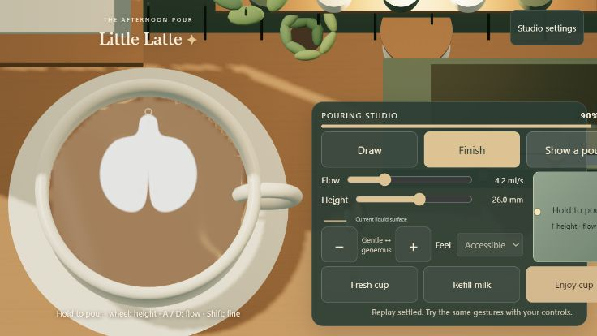
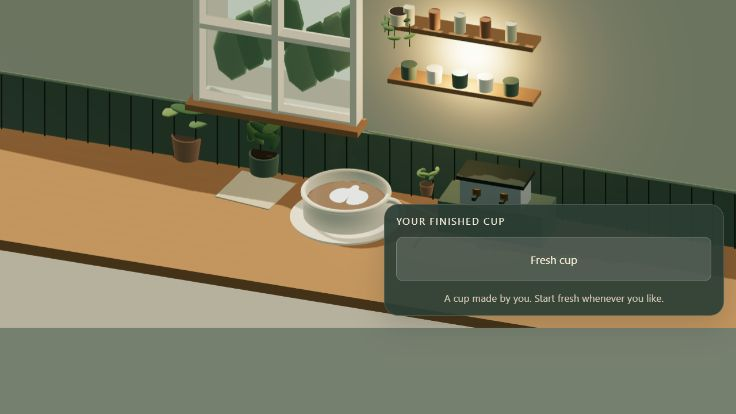

# Little Latte — direction, finish fidelity and photo collection

7 October 2026 · second audit · implementation-ready proposal

## Product direction

Preserve the pouring feel that now works. The next release should let players **orient their pour, make finer final shapes, and photograph their actual creation beautifully**. Keep the cozy window corner and plants, but develop the lighting, materials and camera composition beyond blockout quality. A personal photo collection gives each finished cup a satisfying destination.

The user confirmed that the current Advanced controls should remain unchanged. This audit does not implement gameplay changes or photo mode. It adds this plan, current screenshots and a direction diagnostic. It supersedes the earlier audit's current-state claims; that document remains historical evidence and a broader environment brief.

## Current state and verification

The default is now GPU 3D art with the `gpu-volume-film-3` tapered optical response; the free-surface alternative uses `hydrostatic-film-5`. Adaptive equipment access, shared pitcher dimensions, a stronger moving finishing pinch, and immediate dry control transitions have been added. Fresh cup preserves the current controls. The café has a recessed window, plants, shelves, espresso station, warm practical light and a wider Enjoy cup camera.

Fresh checks during this audit:

- **54 automated tests passed**, zero failures or skips, approximately 83 seconds.
- TypeScript check passed; production build passed. Main bundle: 586.18 kB minified / 157.48 kB gzip; the existing large-chunk warning remains.
- Inspected and ran the default Heart demo and Enjoy cup in the browser. The lobes survive, but the displayed tip remains rounded and the milk looks unusually uniform and matte.
- Evaluated current equipment/jet code at five stationary positions. [Raw direction probes](fidelity-audit-direction-probes.json) reproduce the orientation mismatch below.
- Checked installed Three.js 0.180.0 for PMREM, output postprocessing and asynchronous render-target readback support. These capabilities already exist locally; no engine migration is required for the proposed first release.

The browser captures are from the available compact landscape view, approximately 736×414. A requested desktop override did not produce the requested dimensions in the actual page, so this audit does **not** claim a desktop/portrait breakpoint pass. That override was reset. Physical-phone performance, fresh GPU numerical checks and human success rates remain unverified. Screenshots and passing Node tests are separate evidence.

## Audit findings

### 1. High priority: pitcher orientation and milk momentum disagree

In `src/equipment.ts`, `reachablePitcherYaw()` rotates the pitcher toward available space. However, `solveLatteJet()` always adds the outlet speed to **positive Y** via `jet.incoming.y += ...`. It does not rotate that outlet vector with the pitcher. The film then uses this same incoming vector to drive its local flow.

At 63 ml initial fill, Draw at 35% delivery, zero hand movement:

| Aim | Pitcher yaw | Pitcher horizontal forward | Added horizontal milk velocity |
| --- | ---: | --- | --- |
| Center (0.50, 0.50) | 180° | +Y | +Y, 0.11583 m/s |
| Upper area (0.50, 0.25) | 0° | −Y | +Y, 0.11583 m/s |
| Left (0.25, 0.50) | 208.65° | diagonal left/+Y | +Y, 0.11583 m/s |
| Right (0.75, 0.50) | 151.35° | diagonal right/+Y | +Y, 0.11583 m/s |

Clearance in these probes is approximately 3 mm: the earlier access-height problem has improved, but directional consistency has not. At the upper sample, the outlet impulse points opposite the pitcher's horizontal forward direction. The rendered ballistic stream still ends at the target; endpoint agreement alone cannot catch an inconsistent spout orientation.

**Consequence:** moving around the cup can change the visible equipment pose while preserving a hidden preferred pattern direction. Turning all pours “backwards” would just substitute another fixed preference.

### 2. High priority: the demo mixes Cozy and Advanced control values

`heartArtReplay` carries Cozy metadata. During replay, `main.ts` assigns its normalized delivery to the flow slider even when the visible scheme remains Advanced. The ending `.35` delivery therefore displays as **4.2 ml/s** in Advanced, although the scripted Finish flow is `.137 × 12 = 1.644 ml/s`. The browser showed 4.2 ml/s after the demonstration, and Fresh cup retained that slider setting.

**Consequence:** copying the demonstration can start with a different finishing flow. This is a unit-conversion/UI handoff issue, not a reason to replace the solver. The replay itself still uses its scripted physical flow.

**Fix direction:** make the visible controls reflect physical values in Advanced and normalized delivery in Cozy, then explicitly synchronize the selected scheme and runtime state when playback ends. Preserve the user's scheme. Cover replay completion, interruption, reset and imported recordings.

### 3. High priority: final-shape acceptance is narrower than the desired quality

The stronger taper is a useful improvement. But current heart measurements assume a vertical, centered design: `src/art-metrics.ts` partitions at the grid midpoint and measures rows along Y. The taper-specific test exercises one cut speed and the isolated `heartPour()` path disables assistance. Existing wider tests cover the older local response across three speeds.

At 160², the approximately 82.5 mm domain resolves about **0.515 mm per cell**. A 14-cell tip-width result is about 7.2 mm across the measured terminal band, not proof of a sharp apex. That metric is the maximum width over a terminal region, not the width at the final tip. Raising screenshot resolution cannot recover unrepresented shape detail.

The optical field still has independent source-driven flow and a 35 ms velocity-decay time constant. Its limited bulk coupling remains an approximation; it should be investigated narrowly if it blocks the desired behavior rather than reopened as a wholesale rewrite.

**Fix direction:** separate silhouette, internal bands, edge gradients and material appearance. Measure shapes in the commanded design orientation. Test the default assisted route, release timing, curved and off-center cuts, and rotated gestures. A/B 160² against a finer field before deciding whether more resolution materially improves the result. Do not use sharpening or bloom to disguise a blunt simulated shape.

### 4. High priority: lighting changes cannot yet make the liquid look photographic

`src/scene.ts` uses a custom color blend with a fixed UV highlight. Free-surface mode adds a height-gradient highlight, but the default GPU mode uses the level disk and does not use that free-surface normal calculation. The liquid is not coherently shaded by the room's lights/reflection environment. There is no assigned scene environment, and the stream uses an unlit material.

The room now has more objects, but the image still reads as broad flat colors, primitive silhouettes and disconnected material responses. Metal needs an environment to reflect; milk needs satin highlights, coffee needs depth and wetness, and ceramic needs glaze and shape. The same improvements will directly improve photo mode.

### 5. Medium priority: Enjoy cup is a room view, not a latte photograph

The current fixed orthographic Enjoy camera reveals the room but makes the actual art small. UI remains in view, and there is no focal-length, framing, background or depth-of-field workflow. Plants and outside greenery are still visibly simplified geometry.

Keep Enjoy cup as a useful transition, but add a dedicated photographic camera and clean composition. A photo should make the player's art the subject, with enough café context to give it character.

### 6. Feature gap: no saved-photo lifecycle exists

Current persistence stores tuning in localStorage and exports recording/measurement JSON. The developer GPU check can capture a canvas image, but there is no user photo mode, image store, thumbnail grid, durable shot metadata or error recovery.

This needs a small feature architecture, not just a screenshot button. Saved images must remain unchanged after a new pour, shader update or scene shuffle.

## Directional control design

Distinguish four concepts in code and in the controls:

| Control | Meaning | Proposed interaction |
| --- | --- | --- |
| Aim/hand travel | Where the jet lands and how the hand moves | Existing pointer/touch steering; preserve the current feel |
| Pour bearing | Which way the spout faces and pushes milk | Small direction ring with a clear arrow; Q/E adjustment as an initial keyboard mapping |
| Cup presentation rotation | View/handle orientation for comfort and photos | Optional dry reposition first; do not rotate only the art texture |
| Cup tilt | Physical lean for access and pouring | Separate later bounded feature, with gravity and rim behavior validated |

Keep wheel=height, A/D=flow and Shift=fine. Provide an accessible bearing slider/buttons as well as the ring. On touch, set and lock bearing before a stroke so a third simultaneous finger is unnecessary. Keyboard shortcuts must ignore editable fields. Offer “keep my direction” as the normal explicit orientation behavior; any adaptive direction assist must be visible and optional.

For the first release, prioritize bearing control over full cup tilt. Cup tilt changes the physical geometry and should not be faked by tilting the rendered liquid with the cup. Similarly, physically rotating a cup while wet is not equivalent to changing camera azimuth; defer its additional liquid forces until modeled.

**Coordinate contract:** declare a world/cup/pitcher transform and one bearing convention. Rotate the local outlet vector by the actual spout pose; add inherited hand velocity separately. Derive stream trajectory, footprint, equipment clearance, visuals and film forcing from the same jet state. Use angle interpolation across the ±π boundary and make filtering independent of render rate. Record bearing, assistance and transform/model version; old recordings retain their historical fixed-axis interpretation.

A direction arrow should explain where milk pushes while a separate optional motion cue explains the gesture. Moving backward while the spout faces forward must be possible; do not automatically align the spout to pointer velocity. That distinction is central to layered patterns.

There is no universal screen-space “baristas never go forward” rule. Published [La Marzocco guidance](https://home.lamarzoccousa.com/practicing-latte-art/) distinguishes placement, lateral wiggles and the raised cut-through, with cup tilt changing during the pour. The product goal is to support these relative motions rather than prescribe one screen direction. Reference gestures should be labeled relative to the cup and spout.

## Shader and world fidelity plan

### Establish one lighting and color pipeline

Use the current WebGL/Three.js engine. Build a controlled window-lit reference scene with a matching prefiltered environment. Preserve linear lighting and apply tone mapping/output encoding exactly once, both on screen and in exported photos. Validate cream whites, dark coffee and wood against a fixed reference capture before adding a creative grade. The installed engine already includes the required PMREM and output-pass support.

Use a large soft window key, subdued ambient fill and a warm practical light. Keep the room's visible window and the reflected window direction consistent. Bake or approximate static ambient/contact lighting where useful. Reserve expensive live shadows for important moving objects.

### Material priorities

| Surface | Target look | Implementation direction |
| --- | --- | --- |
| Coffee + milk | Wet espresso and satin foam, with readable fine boundaries | Light-responsive shader using the real purity/composition fields, meaningful normals, spatial roughness and restrained Fresnel reflection; no replacement art mask |
| Rim contact | Thin curved meniscus and a grounded liquid edge | Geometry or controlled displacement consistent with fill, vessel dimensions and the surface shape |
| Milk detail | Fine soft microstructure, not visible white gravel | Low-amplitude material detail tied to stable surface coordinates; eventually advected detail where justified, never screen-space swimming noise |
| Stream | A continuous lit ribbon/jet connected to the pouring lip | Shared ballistic geometry, correct normals, matching milk material and an impact response driven by accepted flow |
| Ceramic | Rounded glaze highlights and believable wall thickness | Refined geometry, controlled clearcoat/roughness, subtle surface variation |
| Pitcher | Brushed stainless with readable window reflections | Shaped spout/interior, correct metal response and restrained anisotropy |
| Plants | Thin leaves with veins, stems and transmitted warm light | Replace scaled spheres with shaped leaves; restrained backlighting, varied orientation and shared geometry/materials |
| Counter/props | Tactile wood, linen and pottery | Scale-correct texture/normal/roughness maps, bevels and contact shadows |

Implement the liquid as a maintainable material module, either a pinned-r180 PBR extension with tested shader hooks or an explicit custom shader with the needed light/environment inputs. Choose after a small visual/performance comparison. Merely swapping the current shader for a generic physical material would lose field-driven appearance. [Three.js physical materials](https://threejs.org/docs/pages/MeshPhysicalMaterial.html) provide clearcoat and anisotropy, but add cost as features are enabled; use them selectively.

**Live versus photo quality:** keep simulation behavior identical. Live play prioritizes stable edges, low latency and restrained reflections. Photo mode can spend more on supersampling, contact shadows and subtle depth of field because it renders on demand. Keep the full latte-art surface in focus; blur the room rather than the design. Avoid aggressive bloom, chromatic aberration or grain that obscures the work.

## Feature specification: Save a shot → My pours

### Player flow

1. Finish pouring and choose **Take photo**, available beside Enjoy cup.
2. Capture an immutable render snapshot of the cup at that moment. Show a clean preview without aiming markers, pitcher or gameplay panels. The same art is retained across all composition choices.
3. Offer **Another angle**, **Setting**, a modest framing adjustment, and square/portrait crop. Make the initial automatic suggestion attractive enough that saving requires only one more tap.
4. Choose **Save shot**. Show success only after the image and metadata are durably committed. Optional title/caption can be added without interrupting a quick save.
5. **My pours** opens a profile-like collection with a personal header, cup count and a compact three-column grid. A thumbnail opens the full photo with title/date, download, favorite and delete/undo actions. Return to the game without resetting the cup.

This is an in-game personal collection inspired by an Instagram profile, with no account or social posting requirement. Exported photos can be shared by the user. Actual Instagram integration is outside the first feature slice.

### Curated variation, not unrestricted randomness

Start with three settings made from the same coherent café art kit:

| Setting | Background/props | Lighting/composition |
| --- | --- | --- |
| Window seat | Oak, cream linen, soft leaves near frame edge | Warm side light; overhead or gentle three-quarter view |
| Quiet morning | Sage wall, journal, ceramic planter | Soft neutral daylight; clean negative space |
| Closing time | Darker wood, warm brass lamp, blurred shelves | Warm practical light with subtle cooler fill; intimate three-quarter view |

Provide three tested camera families per setting: near-overhead art study, three-quarter cup portrait, and a wider contextual café portrait. Use a perspective photo camera with a moderate focal length for the latter two. Default square at 1080×1080; offer 4:5 portrait at 1080×1350. These are product choices, not a claim about current social-platform requirements. Use square thumbnails with a stored safe crop for portrait originals.

Vary azimuth, distance, prop offsets, linen orientation, exposure and light warmth within authored bounds. Avoid the immediately previous setting/angle combination when alternatives exist. Offer a manual shuffle; do not cycle backgrounds continuously. Keep lighting and camera choices deterministic through a stored seed and recipe version.

Reject compositions that clip the rim/handle, hide the art, put a prop through the cup, crop the design or create a large reflection across its center. A provisional photo target is cup width of 45–70% of the image with an unobstructed art surface; contextual shots may relax that deliberately. Keep changes to presentation: every variant uses the identical milk field and fill state.

### Capture and storage architecture

Separate responsibilities into small modules such as `pour-pose`, `liquid-material`, `photo-scene`, `photo-capture`, `photo-store` and `photo-gallery`. Extract the necessary scene handles from `createScene`; do not turn its current giant return object into a photo subsystem.

- **Cup snapshot:** copy the optical field and all render-relevant composition/height data, fill level, cup geometry/material IDs, transform, snapshot tick and source model version. Copy GPU textures or read them once on demand; do not keep references to live ping-pong buffers. Capture at one simulation boundary so fields agree. This is a render snapshot, not a promise to resume the full fluid simulation.
- **Independent photo scene:** use a separate camera and photo presentation state with immutable snapshot textures. Changing backgrounds or framing must not change the live scene, camera, controls, liquid inventory or recording clock. Opening gallery/capture releases active pointers and cannot leave a pour running. Cancel returns safely and dry without replay catch-up.
- **On-demand render:** render at a fixed output resolution to a dedicated target, apply the final color pipeline, read back and encode a Blob. Prefer the supported asynchronous readback where appropriate. Check vertical image orientation, alpha, output color and preview/export agreement. Do not enable permanent drawing-buffer preservation merely to save occasional images. Load photo assets from the app's trusted/same-origin asset pipeline with correct cross-origin handling.
- **Persistent record:** store final image Blob, thumbnail Blob, ID, title, creation time, dimensions, crop, favorite flag, cup snapshot ID/hash, seed and photo recipe/material/asset versions. Persist the render snapshot if reopening a saved cup for new angles is included; the final saved image remains the authoritative original even after renderer updates. Multiple photos can reference one snapshot.
- **Local database:** use IndexedDB for images and metadata with schema migrations and atomic commits. localStorage remains suitable only for small preferences. Load thumbnails lazily; do not load every original into GPU memory. Dispose temporary render targets/textures and revoke object URLs.
- **Failure behavior:** catch encoding, context-loss, transaction and quota errors. Keep the preview and offer download/retry; do not silently delete older images or claim a failed save succeeded. Debounce Save and handle double taps. Make delete recoverable through undo/trash, then clean up unreferenced snapshots.

Browser storage is tied to the origin and is normally best-effort. Use a stable app origin, offer image/collection export, and show a small “Saved on this device” label. Request persistence where supported, but do not promise a cloud backup. Storage limits and eviction differ by browser, as described in [MDN's storage guidance](https://developer.mozilla.org/en-US/docs/Web/API/Storage_API/Storage_quotas_and_eviction_criteria). Gallery thumbnails must work after refresh without rerunning the solver or fetching external media.

## Build sequence and acceptance

| Slice | Deliverable | Required proof |
| --- | --- | --- |
| 1. Direction and demo consistency | Shared spout bearing, explicit orientation control, safe assist behavior, corrected Advanced replay handoff | Stationary outlet direction agrees with spout; endpoint agrees with aim; ±π interpolation is continuous; release remains dry; demo shows/reuses actual physical flow; old recordings still play as recorded |
| 2. Finish quality | Orientation-aware metrics and targeted tip/band improvements | Heart, rosetta and neighboring pools at 0/90/180/270°; several placements, speeds and releases; canonical-frame comparisons with declared interpolation tolerances; no hidden silhouette correction; real mouse and touch attempts |
| 3. Photographic material slice | One excellent cup/stream/pitcher under a coherent window light | Matched before/after renders of identical art, active and settled; art remains readable; highlights move correctly with camera/light; correct default GPU and free-surface paths |
| 4. Photo vertical slice | One setting, three camera compositions, immutable capture, save and gallery | First saved shot survives refresh and Fresh cup; exported image matches preview; angle changes preserve snapshot hash; repeated Save creates no accidental duplicates; errors preserve unsaved preview |
| 5. Photo collection polish | Three settings, bounded variations, titles/favorites/download/delete, profile grid | Nine-photo contact sheet visibly varied but coherent; 100-thumbnail gallery remains responsive; migration and quota-failure checks; saved originals stay immutable across renderer changes |
| 6. World finish and device pass | Detailed plants/props, refined light/materials, compact controls and quality tiers | Validated play/photo layouts at compact portrait, landscape and desktop sizes; named physical-phone timing/memory results; stable live controls and no capture-related resource growth |

Material look development and photo scene composition can advance while directional behavior is being corrected. Do not make the photo feature wait for perfect fluid physics; the first vertical slice should prove the loop of **pour → compose → save → collect** early. Final visual acceptance depends on both shape and shading.

Provisional performance targets: smooth 60 fps live play on the chosen target hardware, a usable photo preview while the final render is pending, and a 1080px save within two seconds after assets are warm. Measure these before promising them; use lower-cost visual settings or asynchronous progress as needed. No requirement to increase solver resolution solely because a photograph is high resolution.

## Required tests beyond the current suite

- Rotate a full gesture plus its bearing, then compare fields in a canonical design frame. Test reflected left-handed input separately; a physical handedness change is not an arbitrary texture mirror.
- At fixed aim with zero hand velocity, rotate bearing and verify the source impulse follows it. With fixed bearing, move in both directions and verify inherited hand momentum remains distinct.
- Exercise assist/manual transitions at the rim without sudden yaw flips, clipping or silently overriding explicit direction. Record and replay these at 30/60/120 Hz schedules.
- Measure last-millimeter taper, notch and lobe retention separately; compare same emitted volume and release timing. Keep numerical bounds/conservation and visual review together.
- Capture during settling, after settling, after a resize and after restoring from the gallery. Background changes must not mutate source arrays; cancel must leave gameplay safe.
- Check image dimensions, vertical orientation, color-space agreement, alpha, crop and no-UI capture. Verify photos from the GPU default and fallback modes.
- Verify refresh persistence, schema upgrade, large collection paging, storage-denied/quota failure, double Save, delete/undo and missing snapshot/version handling.
- Profile repeated open/capture/close cycles for GPU/Blob/object-URL memory growth. Test WebGL context loss recovery and low-memory export fallback on a physical phone.

## Immediate next build

Deliver two tangible improvements: **directionally coherent manual pouring with a correct demo handoff**, and **one beautiful window-lit photo setup that saves the actual cup into a persistent grid**. Expand settings and advanced shader effects after that end-to-end experience works. Keep the current pouring feel and Advanced controls as the baseline throughout.

Technical sources: installed Three.js r180 implementation; [WebGLRenderer readback](https://threejs.org/docs/pages/WebGLRenderer.html); [PMREM environment filtering](https://threejs.org/docs/pages/PMREMGenerator.html); [IndexedDB usage](https://developer.mozilla.org/en-US/docs/Web/API/IndexedDB_API/Using_IndexedDB). They support the implementation options above, not a claim that the planned feature already exists.
