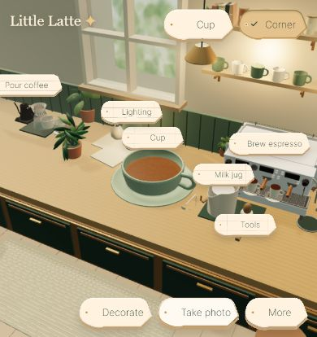

# Lightweight world controls

The Figma button artwork is retained, with compact sizing following the request to keep the game unobstructed. Main actions use 36px controls (40px for coarse pointers); world labels use smaller silhouettes. The reference kit's 168px showcase minimum is intentionally replaced by content-sized controls.

Cup, jug, tools and lighting have world labels and small contextual controls. Click a cup or placed decoration directly; dragging still turns the cup or moves the decoration. Decorations can be rotated, swapped or removed from their context control. The jug offers milk presets and steaming guidance; its appearance choices are folded away. Lighting changes apply directly. Hold or right-click a brewing label to swap its equipment without opening the workshop.

Workshop browsing is a compact panel, with a category selector and scrolling content. Pour controls start closed. Brewing labels and object controls disappear while a station operates. The preparation gauge remains at the screen edge.

Espresso cup and tray heights now match the outlets for classic and upgraded machines. The wand has a separate drain location, and stopping milk steaming automatically purges for 2.5 seconds after the jug moves away. Milk guidance recommends stopping at 5–9 seconds on the game gauge; Silky, Light and Thick presets supplement prepared milk.

Validation: TypeScript and production build passed; 13 brewing, milk recipe, workshop and foam-tool checks passed. Browser checks confirmed direct cup interaction, compact milk controls, world equipment customization, automatic purging and narrow layout. No browser errors were reported. Saved room appearance was preserved.

