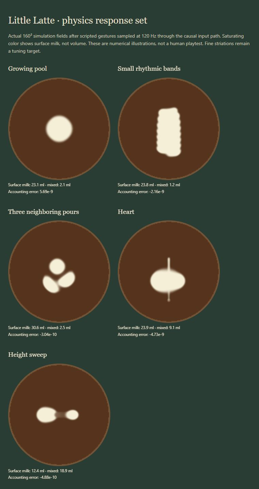

# Physics and precision verification

October 7, 2026. Implemented in the existing Little Latte sandbox. The guide was used as milestone context for the user's next-build request; its quoted launch prompt was not treated as a separate user instruction. Music, cafe assets and prior uncommitted work remain intact.

## Outcome

The known thumb-pickup and nearly flow-independent force defects are fixed. The new shared physical jet, transported velocity, pressure response, material-dependent viscosity and conservative foam transport give cleaner growing pools and modest displacement by neighboring pours. Actual input can be recorded, exported, imported and causally replayed.

The central fine-band target remains incomplete. The small rhythmic fixture produces a scalloped column rather than distinct striations. The previous heart gesture produces an oval with a thin finishing stroke. These results are shown directly, without a shape stamp, image injection, sharpening fix or target-specific force. This is an improved empirical sandbox, not verified barista realism.

## Baseline and response measurements

The original independent probe output is preserved in [physics-baseline.json](physics-baseline.json), and the old solver in [surface-baseline.ts.txt](surface-baseline.ts.txt). The equivalent force probe and expanded behavior set are generated by `tests/evidence.ts` into [physics-response-results.json](physics-response-results.json). Previous sparse replay comparisons are not directly comparable: scripts are now sampled at 120 Hz and use receipt deadlines.

Identical 0.02 UV movement over 1/60 s at normalized height 0.8 on a resting production-size field:

| Requested flow | Before peak UV/s | After peak UV/s | After spatial mean speed UV/s |
| --- | ---: | ---: | ---: |
| 0 | 0 | 0 | 0 |
| 0.000001 | 0.164397 | 2.97337e-9 | 8.56102e-11 |
| 0.1 | 0.165758 | 0.000299023 | 8.64046e-6 |
| 0.5 | 0.166595 | 0.00150951 | 4.38772e-5 |
| 1 | 0.166952 | 0.00286296 | 8.89496e-5 |

New directional incoming impulse scales with emitted mass: full/10% is 10 for the fixed lateral-velocity probe. Peak velocity is not required to obey an exact ratio because exit speed, footprint and pressure also vary. Zero quantity creates neither force nor deposit; budget-limited actual volume supplies both rendering and simulation.

The response matrix covers three flows and six heights. At 6 ml/s for 0.75 s, 4.5 ml is accounted for throughout: surface milk decreases smoothly from 4.309 ml at 2 mm to 0.027 ml at 80 mm; the bulk reservoir increases from 0.191 to 4.473 ml. This is an empirical partition, not measured real-cup data. Equal-quantity paths of 0.12 and 0.6 UV both emit 15.600008 ml; the faster path has a broader, lower-concentration footprint.

An adjacent-pour subtraction estimates earlier pool displacement at 0.02263 UV, approximately 1.87 mm. This isolation is approximate because foam-dependent viscosity makes new-only subtraction nonlinear. It establishes a response; the modest displacement and lack of fine bands still require visual calibration.

[Open all five fields](physics-fields.html). These are actual 160² fields after generic scripted gestures, with a saturating color display. Numerical conservation errors in these examples are below 6e-9 in scaled field-integral units. Rendering contrast does not restore missing striations.

[Finished neighboring pours in the actual sandbox](physics-three-pours.jpg) shows the same generic practice gesture rendered in the cafe scene. This is a scripted browser example, not a human attempt.

## Input and browser evidence

The simulation has a declared 33.3 ms interpolation buffer plus tick/display phase. Both preloaded playback and incrementally available live packets are limited to each tick's receipt deadline. Late timestamps are clamped; dry stroke gaps are never interpolated as wet. Recorded cancellations and skipped pause intervals prevent replay from spending milk during a pause. Stalls over 150 ms discard pending wet history.

An actual browser automation mouse recording contains 1,284 packets, five wet strokes and 10.2082 seconds, with no recorded skip intervals. It was exported through the app and saved as [recorded-mouse.json](recorded-mouse.json); import through the real file chooser succeeded. This is automated mouse interaction, not a human playtest. The live and replay snapshots were taken after different dry settling durations:

| Quantity | Live browser | Browser replay |
| --- | ---: | ---: |
| Emitted ledger units | 1.621744800000659 | 1.621744800000653 |
| Remaining budget % | 87.02604159999490 | 87.02604159999491 |
| Scaled foam integral | 0.0554673345178875 | 0.0554673345247689 |
| Foam center x / y UV | 0.520592091812 / 0.424108020359 | 0.520592091818 / 0.424108020377 |

[Live snapshot](recorded-mouse-live.json), [replay snapshot](recorded-mouse-replay.json). They match milk usage and settled amount/center within floating-point tolerance. Snapshot stall counters include later dry browser activity and do not constitute mobile performance evidence. A final diagnostic fix sums incoming impulse magnitude before source merging; archived browser impulse values predate that diagnostic-only correction.

The saved packet fixture also passes 30/60/120 Hz display comparisons with identical 64² Float32 fields. Separate tests cover 30/60/125/240 Hz input with 0–4 ms receipt jitter, sub-frame taps, pauses and dry restarts. This reduced-grid cadence comparison is distinct from the production-size visual evidence and live-browser scalar comparison.

[Browser control checks](physics-controls.txt) exercise the actual app listeners with synthetic two-pointer events: anchored pickup, axis adjustment, release retention, edge re-clutch, finger-order independence, cancellation, blur/focus, safe text editing, tap emission and Finish. Pointer capture is stubbed for synthetic IDs; real touchscreen capture/comfort remains unverified.

## Layout and performance

The actual app was inspected in dimensioned browser frames at [320×568](physics-short-phone.jpg), [390×844](physics-portrait.jpg), [768×1024](physics-tablet.jpg) and [1280×720](physics-wide.jpg). Flow/height labels, near-surface cue, pour pad and action buttons fit. The camera keeps the cup usable on short screens. Browser frames are not physical touch-device evidence. The pitcher still partly occupies the immediate contact neighborhood; emerging patterns are clearest after release/Finish.

One idle desktop browser sample showed 144 fps, 1.8 ms simulation, 0.2 ms display preparation and 0.3 ms rendering per display frame. It is an idle observation, not a pour benchmark or a device certification. CPU display preparation is timed separately; actual GPU texture upload occurs during rendering and is not independently measured. Production builds retain Vite's advisory for the approximately 523 KB main bundle. No dependency changes were made.

## Checks and next playtest

TypeScript compilation, production build and 26 regression tests pass. The earlier exact-heart pixel regression was replaced with accounted pool/finishing behavior because it depended on unscaled pointer drag; its former shape is not claimed as preserved. The original 15-test baseline passed before the replacement. Full rest, wall, budget and conservation checks remain.

The next playtest should use one desktop mouse and one actual phone, testing both handed layouts. For each, make three stationary low pools at different flows, small lateral oscillations at approximately 2–5 mm and two distinct rhythms, three nearby separate pours, and a raised reduced-flow finishing stroke. Repeat each gesture three times using exported recordings. Check pickup/re-clutch without jumps, contact visibility, ease of holding a near-surface gap, release response, stroke preservation and perceived buffer delay. On the phone, verify capture, safe areas, accidental scroll, both finger orders, blur/resume and empty-pitcher behavior. Record wet-pour timings and stalls on that hardware.

Use those recordings to tune generic spreading/pressure and entrainment until small oscillations produce a few separated bands and earlier pools visibly move without arbitrary erasure. Reference-video observation and uncertainty estimates remain outstanding; written primary sources informed qualitative expectations only. Do not add new modes or claim this milestone's fine-band acceptance is complete before those results improve.
